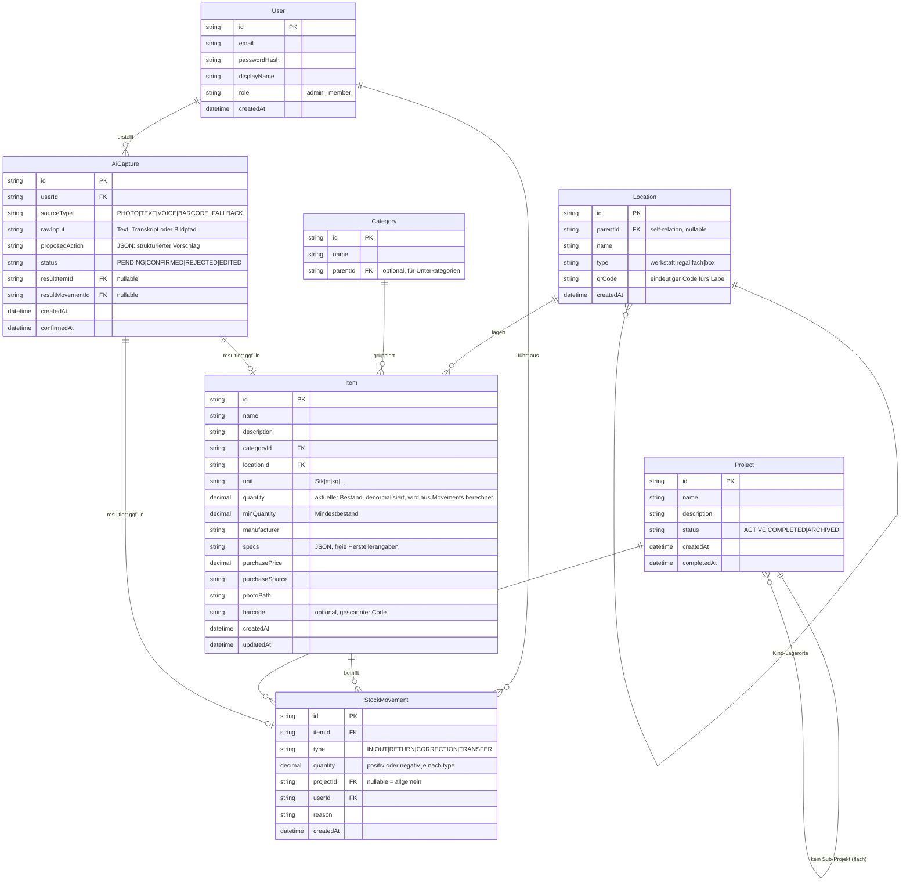

# Werkstatt-Lagerverwaltung — Architektur & MVP-Scope

## 1. Tech-Stack

| Bereich | Wahl | Begründung |
|---|---|---|
| Frontend | Next.js 14 (App Router) + TypeScript + Tailwind CSS | Ein Framework für SSR/SPA-Hybrid, gute PWA-Unterstützung (`next-pwa`), React-Ökosystem für Kamera-/QR-Libraries |
| PWA | `next-pwa` (Workbox) + Web App Manifest | Installierbar auf Handy/Desktop, Offline-Shell, kein separater App-Build nötig |
| Backend | Node.js + TypeScript + Fastify | Gleiche Sprache wie Frontend (TS durchgängig, Typen teilbar), Fastify ist leichtgewichtig, schnell, gutes Plugin-System, offizielles Anthropic-TS-SDK direkt nutzbar |
| ORM / DB-Zugriff | Prisma | Typsichere Queries, Migrationswerkzeug eingebaut, gute DX für Ein-Personen-Projekt |
| Datenbank | PostgreSQL 16 | Robust bei gleichzeitigen Schreibzugriffen (Handy + Desktop parallel, später Mehrbenutzer), ausgereiftes Migrationstooling |
| Objektspeicher (Fotos) | Lokales Docker-Volume, verwaltet vom Backend | Kein zusätzlicher Service nötig für Ein-Host-Setup; Migrationspfad zu S3/MinIO bleibt offen (Speicher-Layer ist gekapselt) |
| Auth | Session-Cookie (httpOnly) + Argon2-Passwort-Hash | Einfach, kein SSO-Overhead, aber `User`-Referenz von Anfang an im Schema für Mehrbenutzer-Fähigkeit |
| KI Foto-/Text-Erfassung | Anthropic API (Claude, Vision + Text), eigener API-Key aus ENV | Wie gefordert, kein Embedded-Key |
| Sprachnotizen-Transkription | Lokal self-hosted: `onerahmet/openai-whisper-asr-webservice` (faster-whisper) als eigener Container | Bleibt komplett self-hosted, kein zweiter Cloud-Anbieter, passt zum bestehenden Self-Hosting-Ansatz |
| QR-/Barcode-Scan (Browser) | `html5-qrcode` | Reine JS-Lib, nutzt `getUserMedia`, keine nativen Abhängigkeiten, funktioniert in PWA |
| Label-/PDF-Generierung | `pdf-lib` oder `@react-pdf/renderer` (Backend) | Serverseitige Erzeugung von QR-Label-Blättern zum Ausdrucken |
| Deployment | Docker Compose (frontend, backend, postgres, whisper), Cloudflare Tunnel wie bisher | Passt zur bestehenden Infrastruktur (Mac mini, Debian) |

Bewusst **nicht** gewählt: Monorepo-Tooling wie Turborepo/Nx (unnötiger Overhead für ein Ein-Personen-Projekt mit zwei Packages), MinIO/S3 (erst bei Bedarf), Kubernetes, GraphQL (REST reicht für den Scope).

## 2. Datenmodell (Prisma-Schema, konzeptionell)



Designentscheidungen:
- **`quantity` auf `Item` ist denormalisiert** (Performance/Einfachheit), wird aber ausschließlich über gebuchte `StockMovement`-Einträge fortgeschrieben (nie direkt editiert) — so bleibt die Bewegungshistorie die "Source of Truth", der Item-Bestand ein Cache-Wert.
- **`StockMovement.projectId` ist nullable** → "kein Projekt/allgemein" wie gefordert (Punkt 6), aber `userId` ist **Pflichtfeld** von Anfang an (Punkt 15/16).
- **`Location` ist self-referenzierend** → beliebige Tiefe (Werkstatt → Regal → Fach → Box), kein hartkodiertes 4-Ebenen-Modell.
- **`AiCapture` protokolliert jede KI-Interaktion** (Foto, Text, Sprache, Barcode-Fallback) inkl. Rohdaten und Vorschlag, bevor irgendetwas gebucht wird — erzwingt strukturell die Bestätigungspflicht (Punkt 14) und liefert nebenbei ein Audit-Log/Trainingsdaten für spätere Verbesserungen.
- **Transfer zwischen Projekten** wird als zwei `StockMovement`-Einträge abgebildet (RETURN aus Projekt A + OUT auf Projekt B) statt eines eigenen Movement-Typs — hält die Bestandsrechnung simpel (Summe aller Movements pro Item = aktueller Bestand).
- Volltextsuche (Nice-to-have) baut später auf `pg_trgm`/`tsvector` über `Item.name`/`description` auf — kein Schemabruch nötig.

## 3. Projektstruktur

```
/
├── docker-compose.yml
├── docs/
│   └── ARCHITECTURE.md
├── backend/
│   ├── Dockerfile
│   ├── package.json
│   ├── tsconfig.json
│   ├── prisma/
│   │   ├── schema.prisma
│   │   └── migrations/
│   ├── src/
│   │   ├── server.ts
│   │   ├── plugins/          # prisma-client, session-auth
│   │   ├── routes/           # auth, users, locations, categories, items, movements, projects, ai
│   │   ├── services/         # movement-booking-logik, ai-parsing, label-pdf
│   │   └── lib/
│   └── storage/photos/       # Docker-Volume-Mount
├── frontend/
│   ├── Dockerfile
│   ├── package.json
│   ├── next.config.js        # next-pwa
│   ├── public/manifest.json
│   └── src/app/               # App Router Pages
└── whisper/                  # Compose-Service-Config (Image, kein eigener Code)
```

## 4. MVP-Scope (Version 1)

**Enthalten:**
- Datenmodell + Backend-CRUD für User, Location (hierarchisch), Category, Item, StockMovement, Project
- Auth (Login/Session), Single-User startklar, Schema mehrbenutzerfähig
- Bestandsbewegungen (Wareneingang/Entnahme/Rückgabe/Korrektur) inkl. Projekt-Zuordnung
- Mindestbestand-Warnung im Dashboard
- Projekt-Detailansicht mit Materialliste + Kostensumme
- Foto-Upload für Items (ohne KI-Erkennung zunächst manuell befüllbar)
- KI Foto-Erkennung (Punkt 10) mit Bestätigungs-Schritt
- KI Freitext-Erfassung (Punkt 11) mit Bestätigungs-Schritt
- QR-Code-Generierung für Lagerorte + einfaches PDF-Label-Blatt
- PWA-Grundgerüst (installierbar, responsive)

**Bewusst auf später verschoben:**
- Barcode/QR-Scan-Kamera-Flow mit KI-Fallback (Punkt 12) — Foto-Erkennung deckt den Fallback-Fall inhaltlich schon ab, Kamera-Scan-UI kommt nach, wenn CRUD + KI-Flows stehen
- Sprachnotizen/Whisper-Integration (Punkt 13) — technisch vorbereitet (Container im Compose-Stack vorgesehen), UI-Flow folgt nach Text-Erfassung, da funktional fast identisch (Transkript → gleicher Parsing-Flow)
- Projekt-Export als PDF/CSV
- Semantische Volltextsuche
- Statistik-Dashboard (meistgenutzte Teile, Lagerwert)
- Automatische Einkaufslisten-Generierung (Mindestbestand-Liste ist in v1 nur eine Ansicht, kein Workflow)

## 5. Implementierungsreihenfolge
1. ✅ Datenmodell (Prisma-Schema + Migration)
2. ✅ Backend-CRUD (Auth, Locations, Categories, Items, Movements, Projects)
3. Frontend-Grundgerüst (Next.js, PWA, Seiten für obige Ressourcen)
4. KI-Erfassungs-Flows (Foto, Freitext, später Sprache/Barcode)
